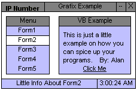



## Basic VB Graphics And Tricks

### Description

Basic Graphics And Tricks, Such As Custom Menu Bar, Form Draging, Hot Spots, Active Time, Users IP And More.
 
### More Info
 

             |
---                |---
**Submitted On**   |2002-09-11 02:37:34
**By**             |[\[Alan\]](https://github.com/Planet-Source-Code/PSCIndex/blob/master/ByAuthor/alan.md)
**Level**          |Beginner
**User Rating**    |3.0 (9 globes from 3 users)
**Compatibility**  |VB 6\.0
**Category**       |[Graphics](https://github.com/Planet-Source-Code/PSCIndex/blob/master/ByCategory/graphics__1-46.md)
**World**          |[Visual Basic](https://github.com/Planet-Source-Code/PSCIndex/blob/master/ByWorld/visual-basic.md)
**Archive File**   |[Basic\_VB\_G1295559112002\.zip](https://github.com/Planet-Source-Code/alan-basic-vb-graphics-and-tricks__1-38865/archive/master.zip)

